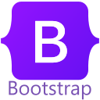
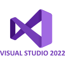

 <h3>
  Hi there! 
  :globe_with_meridians: 
 </h3>
 

---
### :man_technologist:About Me:
I am a Full Stack Developer
- I am german :de: and I live in denmark :denmark:.
- I have been interested in software development since I was young. I love developing solutions for problems and challenges. I like to venture out of my comfort zone to explore new concepts and new techniques.
- I work on the entire software development process - from analysis and planning to coding, deployment and customer support.
- If you need help with your project, you are missing expertise or a worker, contact me: :email: m.koch@neuko-devment.com
---
### :toolbox: Languages and Tools

  
  
  
  
  
  
  
  
  
  
  

---

 

